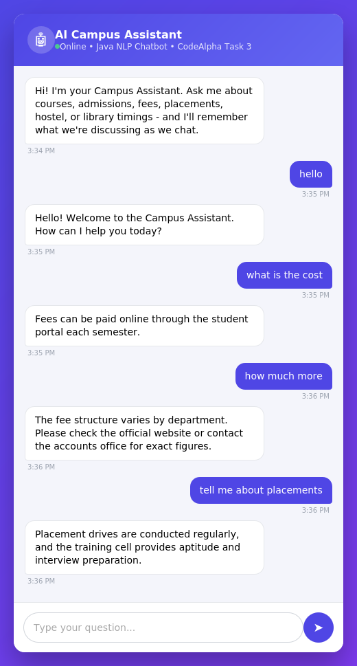

# AI Campus Assistant Chatbot

A Java-based AI chatbot with a web interface, built as part of the **CodeAlpha Java Development Internship (Task 3)**.

## 📋 Features

- **Web-based chat interface** - clean, responsive UI served directly by a Java backend (no external frameworks)
- **NLP preprocessing pipeline** - tokenization, punctuation stripping, stop-word removal, and basic stemming
- **Synonym normalization** - understands related phrasing (e.g. "cost", "price", and "fee" are treated the same)
- **TF-IDF weighted similarity scoring** - a lightweight ML-style ranking method where rarer, more distinctive words carry more weight when matching a question to an intent
- **Session-based context memory** - remembers the current topic, so short follow-up questions like *"how much more?"* are understood without repeating the full question
- **"Did you mean...?" smart suggestions** - when no confident match is found, the bot offers clickable topic suggestions instead of a plain error
- **Trained on FAQs** covering courses, admissions, fees, placements, hostel, library, timings, and contact information

## 🛠️ Technologies Used

- Java (JDK 17+)
- `com.sun.net.httpserver.HttpServer` - built-in Java HTTP server (no external libraries/dependencies)
- HTML, CSS, JavaScript (served directly from the Java backend)
- Custom lightweight JSON parsing/encoding

## ▶️ How to Run

1. Clone this repository:
   ```
   git clone https://github.com/tamilarasi06/CodeAlpha_AIChatbot.git
   ```
2. Navigate to the project folder:
   ```
   cd CodeAlpha_AIChatbot
   ```
3. Compile the program:
   ```
   javac ChatBotServer.java
   ```
4. Run the program:
   ```
   java ChatBotServer
   ```
5. Open your browser and go to:
   ```
   http://localhost:8080
   ```

## 🧠 How the NLP Matching Works

1. **Preprocess** - the user's message is lowercased, cleaned of punctuation, tokenized, and stripped of stop-words
2. **Stem & normalize** - words are reduced to a base form (e.g. "fees" → "fee") and mapped through a synonym table
3. **Score** - the processed tokens are compared against every trained intent's patterns using TF-IDF weighted similarity
4. **Decide** - if the best match is confident enough, that intent's response is returned; if it's a short follow-up to the previous topic, context memory kicks in; otherwise, the bot offers relevant suggestions

## 🖥️ Project Structure

```
CodeAlpha_AIChatbot/
│
├── ChatBotServer.java   # Main application (server + NLP engine + web UI)
└── README.md            # Project documentation
```

## 📸 Screenshot



*Example conversation showing synonym matching ("cost" → fees) and context memory (the follow-up "how much more" is understood as still referring to fees).*

## 👩‍💻 Developed By

**Tamilarasi S**
B.Tech Information Technology, Adhi College of Engineering and Technology
[LinkedIn](https://linkedin.com/in/tamilarasi-s-6668162ba) | [Portfolio](https://tamilarasi06.github.io/portfolio/)

## 🏢 Internship

This project was developed as **Task 3** of the Java Development Internship at **CodeAlpha**.
